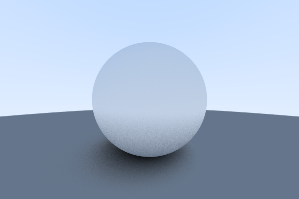
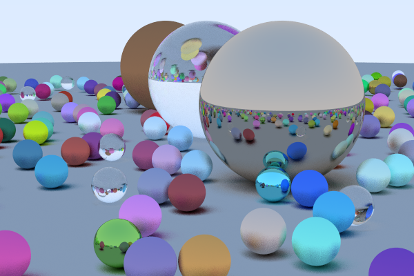

Ray Tracer in a Weekend
========================

Decided to learn more about ray tracing and computer graphics. Implemented this simple ray tracing for spherical objects using C++ from scratch without any additional libraries.
Based on Peter Shirley's [_Ray Tracing in One Weekend_](https://raytracing.github.io/books/RayTracingInOneWeekend.html)

I did this project on my own pace, but I reckon it would take about a weekend if you spend all your time. 
Amazed with the results that such a simple implementation from scratch can get!

### Dependencies
- GCC
- ImageMagick (convert PPM to png)

### Usage
- Compile using `make`
- Render using  `make render`. The rendered image will be generated at `./output.png`
- Clean with  `make clean`

### Results

### Improvements
- [X] Conversion to PNG using ImageMagick
- [X] OpenMP parallel for (if we have multiple cores, why not use them?)
- [ ] CUDA version (let's see how fast this can render!)

### Runtime performance
Rendering a 600x400 image with 100 ray samples per pixel on a Xeon E5-1630 3.7Ghz.
- Without OpenMP, using a single core, the process took 24min.
- Using OpenMP with all 8 available cores the same process took 6min 18s. Almost four times as fast!

