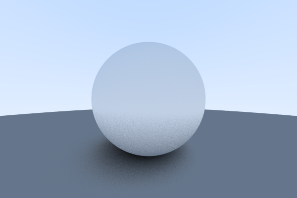
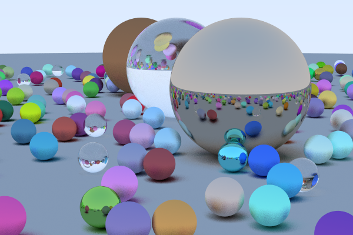

Ray Tracer in a Weekend
========================

Decided to learn more about ray tracing and computer graphics. Implemented this simple ray tracing for spherical objects using C++ from scratch without any additional libraries.
Based on Peter Shirley's [_Ray Tracing in One Weekend_](https://raytracing.github.io/books/RayTracingInOneWeekend.html)

I did this project on my own pace, but I reckon it would take about a weekend if you spend all your time. 
Amazed with the results that such a simple implementation from scratch can get!

### Dependencies
- g++ >= 7.5
- CUDA Toolkit >= 9.1
- ImageMagick (convert PPM to PNG)

### Usage
- Compile using `make`.
- If using CUDA, compile with `make cuda`.
- Render using  `make render`. The rendered image will be generated at `./output.png`.
- Clean with  `make clean`.

### Results

### Improvements
- [X] Conversion to PNG using ImageMagick
- [X] OpenMP parallel for (if we have multiple cores, why not use them?)
- [X] CUDA version (let's see how fast this can render!)

### CUDA Details
Implemented a CUDA version of the Ray Tracer losely following the NVIDIA's [Ray Tracing Accelerated blog post](https://developer.nvidia.com/blog/accelerated-ray-tracing-cuda/).
I was annoyed at having to use the double pointers `camera** cam; hitable** world` to instantiate objects on the device. Who uses double pointers in 2020 anyway?
First I tried the elegant [Managed class operator overloading](https://developer.nvidia.com/blog/unified-memory-in-cuda-6/) solution from NVIDIA's blog post on Unified Memory.
This solution works fine for the `camera` class, but fails for `hitable` and `material` since both these classes use virtual functions. 
The problem is that when an instance is created on the host, even though the parameters are shared in the unified memory, the pointer to the virtual function is in the host domain, and thus, not accessible in the device domain.
The solution is then to use the *unelegant* double pointers.

### Runtime performance
Rendering a 600x400 image with 100 ray samples per pixel on a Xeon E5-1630 3.7Ghz, GPU NVIDIA Quadro M4000 (8GB RAM).

| Device      | Time     |
|-------------|----------|
|CPU (1 core) | 24m      |
|CPU (2 cores)| 6m18s    |
|GPU          | 1m3s     |

- Without OpenMP, using a single core, the process took 24min.
- Using OpenMP with all 8 available cores the same process took 6min 18s. Almost four times as fast!
- The GPU performance is about ~24 times faster than using a single CPU core!

